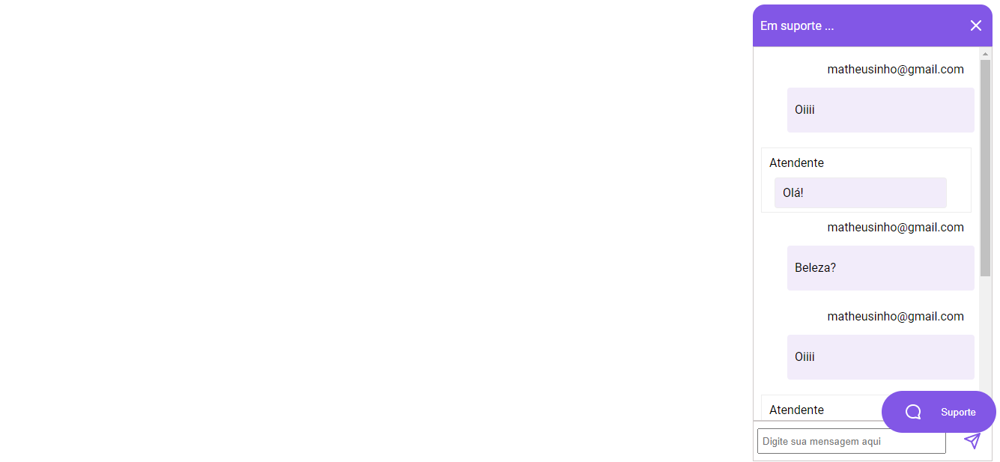
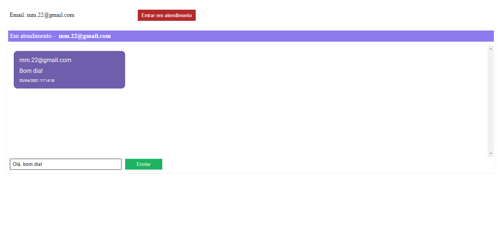

# __Aplicação Chat Websocket__

## **Essa aplicação trata-se de um widget que pode ser implementado em outro projeto.**

 

Essa aplicação foi desenvolvida com base nas aulas ministradas pela professora Daniele Leão da Rocketseat. A aplicação consiste em um chat feito com as ferramentas Typesript para criação de funções e Typeorm para estruturação de dados.

Os Scripts estão separados em diretórios, como:
- controllers
    
    Os controllers são responsáveis por controlar o fluxo de dados.

- database

    No database estão contidos todos os scripts necessários para a criação das tabelas e execução das mesmas.

- entities

    As entities são responsáveis por estruturar as colunas e atributos do banco de dados, uma vez que as tabelas já foram criadas.

- repositories

    Os repositórios permitem manipular os dados para realizar consultas e obter respostas customizáveis.

- services

    Os services são responsáveis por executar os serviços estabelecidos dentro dos repositórios.

- websocket

    Websocket, por fim, faz a integração entre os scripts e as páginas web.

 

**Aba de solicitação de serviço aos atendentes:**

 

 

**Aba de atendimento ao cliente:**

